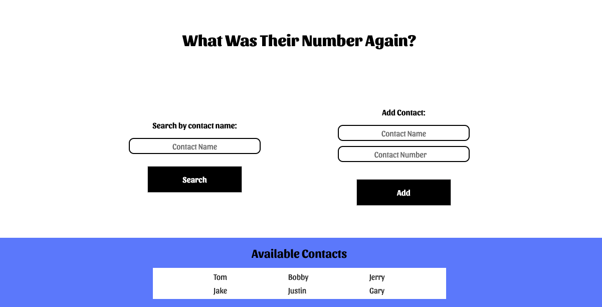

# Contact's Finder

An exercise project from MDN Web Docs to practice and improve my javascript capabilities.
The website allows users to search a contact through an input, which will then search through the existing array elements. If the contact is found it will return their phone number. Additionally, users can add new contacts where the program checks valid input using regex conditions before adding to the available contacts list.

[Visit Link](https://anantjawanda.github.io/find-contacts/)

## Documentation

### JS Overview

When the search button is clicked, an anonmyous function is called, which splits the contact's name from the contact's phone number. The contact's name is stored in a new variable that is compared to the input value.

If the contact name exists in the list, the site will present the corresponding contact's phone number. Otherwise the output area turns red, alerting users that, that contact does not exist.
